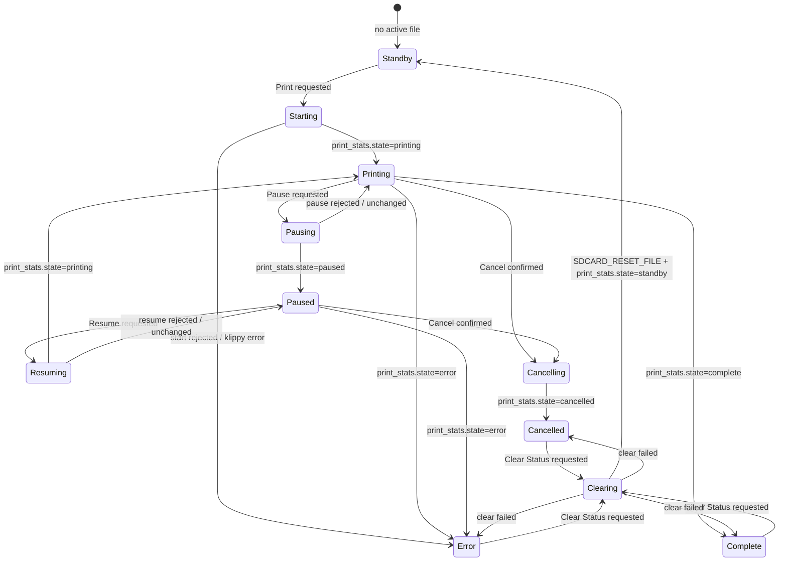

# Job Status State Flow

Job Status separates real printer state from locally requested actions. The UI keeps terminal states visible until `SDCARD_RESET_FILE` returns the printer to `standby`.

Button rules:

- `printing`: show Pause, Cancel, Skip Object, Advanced.
- `paused`: show Resume, Cancel, Skip Object, Advanced.
- `complete`, `cancelled`, `error`: show Clear Status.
- `starting`, `pausing`, `resuming`, `cancelling`, `clearing`: disable job action buttons until Moonraker reports a stable state.
- Only Cancel and Skip Object require confirmation; Pause, Resume, and Clear Status execute directly.
